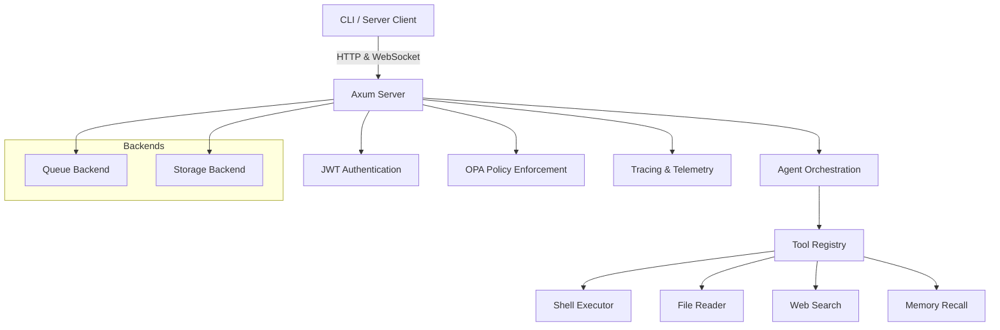

# AI Gateway

AI Gateway is a self-hosted, offline-first AI orchestration platform built in Rust.
It enables secure local AI workflows by combining CLI-driven task orchestration, tool execution, configurable multi-agent roles, and Open Policy Agent enforcement.

## Features

- Multi-agent orchestration with planner/reviewer/executor role configuration
- CLI-first operation with optional WebSocket server mode
- Secure tool execution via centralized registry and policy enforcement
- Configurable storage backends: SQLite default, PostgreSQL optional
- Optional queue backends: in-memory default, RabbitMQ optional
- Local install support with idempotent bootstrap script
- Release-optimized build profile for fast startup and smaller binaries

## Architecture



The architecture is designed for local-first deployments, with a Rust backend that minimizes external dependencies while enabling flexible automation workflows.

## Installation

### Prerequisites

- Rust toolchain (`rustup`, `cargo`)
- `openssl` development libraries
- `pkg-config`
- Optional: Docker for containerized scans

### Local install

Run the idempotent installer:

```bash
./installer.sh
```

This script:

- installs Ollama if missing
- creates the `config/` folder
- preserves existing files on re-run

### Build from source

For development builds:

```bash
cargo build
```

For optimized release builds:

```bash
cargo build --release
strip target/release/ai-gateway
```

### Make targets

- `make build`: development build
- `make release`: release build
- `make strip`: strip symbols from the release binary
- `make audit`: run `cargo audit`
- `make trivy`: run Trivy configuration scan

## Quick Start

### Configure the app

Copy the example configuration and update values:

```bash
cp config.toml.example config.toml
```

Edit `config.toml` for your environment, including `jwt_secret`, `redis_url`, and tool endpoint settings.

### Run the CLI

Send a chat prompt:

```bash
cargo run -- chat "What can you do?"
```

Execute a tool with role-based authorization:

```bash
cargo run -- tools run shell --params "echo hello" --role admin --username cli_user
```

### Run server mode

Start the HTTP/WebSocket server:

```bash
cargo run -- --server
```

Then connect to `/ws` for streaming responses.

## Configuration

The default runtime configuration is defined in `config.toml.example`.

Important fields:

- `storage_backend`: `sqlite` or `postgres`
- `queue_backend`: `in_memory` or `rabbitmq`
- `agents`: named agent roles for orchestration
- `redis_url`: optional cache and rate limiter backend
- `jwt_secret`: required for authenticated endpoints
- `rate_limit`, `rate_limit_window`: request throttling settings

### Multi-Agent Role Example

AI Gateway supports configurable agent pipelines. A common pattern is:

- `planner` – creates a plan from a user prompt
- `executor` – executes the plan using tools
- `reviewer` – validates outputs and approves revisions

Example:

```toml
agents = [
  { name = "planner", role = "planner", description = "Creates task plans and delegates execution." },
  { name = "reviewer", role = "reviewer", description = "Validates outputs and approves or revises results." },
  { name = "executor", role = "executor", description = "Executes plans and returns results." },
]
```

This role-based configuration enables flexible orchestration and clearer separation of responsibilities in complex workflows.

## Tools and Policies

Tools are registered in the centralized tool registry and executed through the runtime layer.

- `Shell Executor`: safely runs shell commands under policy control
- `File Reader`: loads and parses local files
- `Web Search`: performs online searches
- `Memory Recall`: retrieves historical conversation data

Open Policy Agent (`policies/tools.rego`) defines authorization rules for tool access and helps prevent unauthorized actions.

## Developer Guide

### Project layout

- `src/main.rs`: application entrypoint and runtime bootstrapping
- `src/cli.rs`: CLI argument parsing and command dispatch
- `src/config.rs`: configuration parsing and defaults
- `src/agent/core.rs`: agent orchestration and role handling
- `src/tools/registry.rs`: tool registration and lookup
- `src/policy/opa.rs`: policy enforcement integration
- `installer.sh`: idempotent local installation helper
- `config.toml.example`: runtime config template

### Testing

Run the full Rust test suite:

```bash
cargo test
```

### Contribution

- Keep changes small and incremental
- Add tests for new behavior
- Document new configuration and tool behavior
- Preserve the existing architecture and naming conventions

When submitting a pull request, include a short summary of the feature and any relevant usage examples.

## License

MIT
