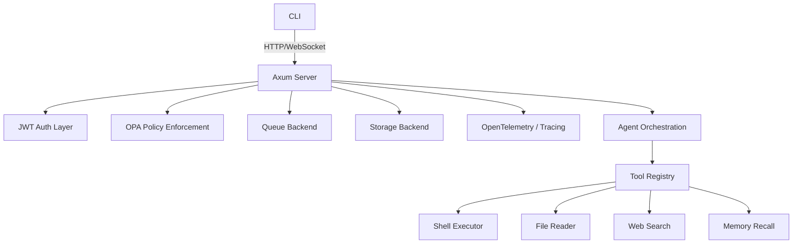

# AI Gateway

AI Gateway is a self-hosted, offline-first AI orchestrator built in Rust.
It combines a rich CLI, optional WebSocket server mode, configurable agent orchestration, tool execution, policy enforcement, storage backends, and local installation support.

## Features

- Local-first AI orchestration with a CLI-first experience
- Configurable multi-agent roles and workflows
- Tool execution with Open Policy Agent (OPA) enforcement
- Optional WebSocket server for real-time streaming
- Configurable storage: SQLite default, PostgreSQL optional
- Optional queue backends: in-memory default, RabbitMQ optional
- Secure tool execution and age encryption for sensitive data

## Quick Start

### 1. Install locally

Run the idempotent installer:

```bash
./installer.sh
```

This script:

- installs Ollama if missing
- creates `config/` and `config.toml`
- leaves existing files intact when re-run

### 2. Review the default config

Copy or open `config.toml` and adjust values for your environment.

```bash
cp config.toml.example config.toml
```

### 3. Build the project

```bash
cargo build
```

### 4. Run the CLI

Send a chat message with the CLI:

```bash
cargo run -- chat "What can you do?"
```

Run a tool with authorization:

```bash
cargo run -- tools run shell --params "echo hello" --role admin --username cli_user
```

Start the server mode:

```bash
cargo run -- --server
```

Then connect to `/ws` for WebSocket-based streaming.

## Architecture



## Local Installation and Usage

### CLI mode

The CLI is the primary interaction mode.
Use `cargo run -- --help` to see available commands.

Example:

```bash
cargo run -- tools list
cargo run -- tools run web_search --params "rust async" --role developer --username alice
```

### Server mode

The server exposes:

- `GET /health` for health checks
- `GET /ws` for WebSocket streaming
- `GET /chat` for authenticated chat requests

Use `config.toml` to configure `redis_url`, `jwt_secret`, and rate limits.

## Configuration

The default configuration is defined in `config.toml.example`.

Important sections:

- `storage_backend`: `sqlite` or `postgres`
- `queue_backend`: `in_memory` or `rabbitmq`
- `agents`: agent names, roles, and descriptions
- `redis_url`: optional Redis endpoint
- `jwt_secret`: required for authenticated chat endpoints
- `rate_limit` and `rate_limit_window`

### Multi-Agent Role Examples

AI Gateway supports configurable agent orchestration with named roles.
A common setup is to split responsibilities across planner, executor, and reviewer agents.

Example configuration:

```toml
agents = [
  { name = "planner", role = "planner", description = "Creates task plans and delegates execution." },
  { name = "executor", role = "executor", description = "Executes plans and returns results." },
  { name = "reviewer", role = "reviewer", description = "Validates outputs and approves or revises results." },
]
```

This pattern lets you express workflows such as:

1. `planner` generates a plan from the user prompt.
2. `executor` carries out the plan using tools.
3. `reviewer` checks the output and suggests revisions or approvals.

Use the agent `role` values in your runtime orchestration logic to route prompts, tool calls, and review steps.

## How to Add a New Tool

Adding a new tool is intentionally simple.
Follow these steps:

1. Create the tool implementation

   - Add a new Rust file under `src/tools/`, for example `src/tools/my_tool.rs`.
   - Implement the `Tool` trait:

     ```rust
     use crate::tools::Tool;

     pub struct MyTool;

     impl Tool for MyTool {
         fn name(&self) -> &'static str {
             "my_tool"
         }

         fn execute(&self, params: &str) -> String {
             format!("Executed my_tool with: {}", params)
         }
     }
     ```

2. Register the tool

   - Update `src/tools/registry.rs`
   - Import the new tool and add it to `ToolRegistry::default()`

3. Add policy rules (if the tool needs authorization)

   - Update `policies/tools.rego`
   - Add rules for the new tool name and allowed roles

4. Add docs and tests

   - Document usage in this README or a tool-specific README section
   - Add unit tests in `src/tools/mod.rs` or `src/tools/<tool>_tests.rs`

5. Verify end-to-end behavior

   - Run `cargo test`
   - Use the CLI to execute the tool:

     ```bash
     cargo run -- tools run my_tool --params "hello" --role developer --username alice
     ```

## Contributing

- Keep changes small and focused
- Write tests for new behavior
- Preserve the existing structure and naming conventions
- Document any new tools, config fields, or deployment features

## Project Layout

Key files:

- `src/main.rs`: entrypoint for CLI and server mode
- `src/cli.rs`: CLI definitions and progress handling
- `src/config.rs`: config parsing and defaults
- `src/agent/core.rs`: orchestration and agent loop
- `src/tools/registry.rs`: tool registration and lookup
- `src/policy/opa.rs`: OPA policy enforcement
- `installer.sh`: idempotent local install helper
- `config.toml.example`: default runtime configuration

## Contact

This project is intended for local, self-hosted AI orchestration. Contributions and documentation improvements are welcome.
