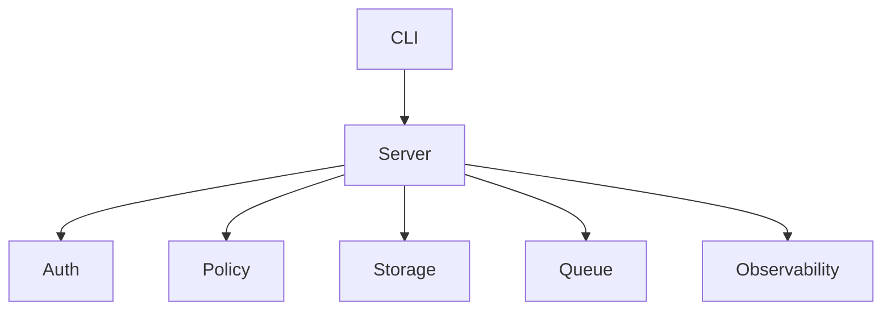

# Architecture

This repository is structured as a Rust workspace for a modular AI gateway.

```mermaid
graph TD
  A[CLI] --> B[Server]
  B --> C[Auth]
  B --> D[Policy]
  B --> E[Storage]
  B --> F[Queue]
  B --> G[Observability]
```
